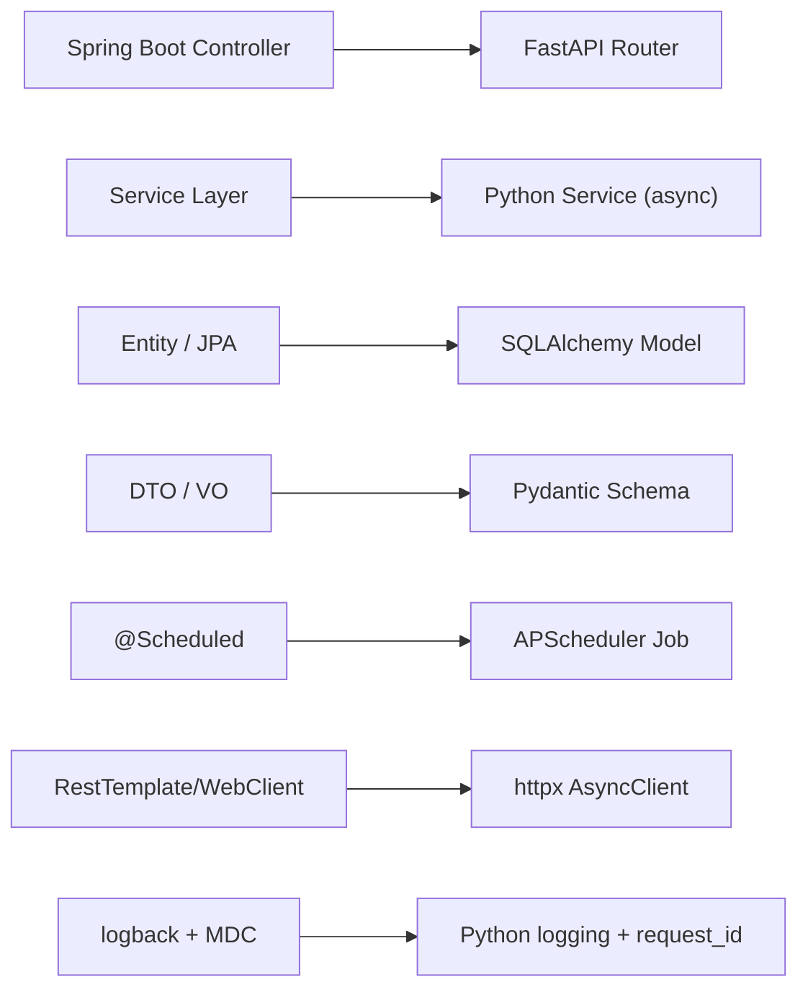
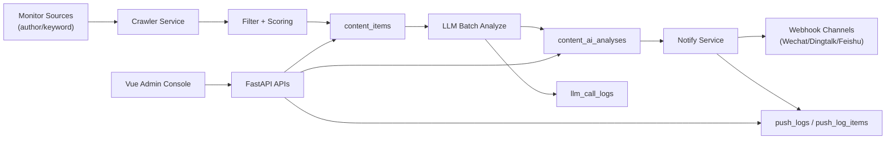

# Bin AI Tech Aggregator

<p align="center">
  <strong>AI 技术资讯监控与推送系统</strong><br/>
  聚合 Twitter 技术内容，自动 AI 提炼，定时推送到企业协作渠道。<br/>
  给 Java 工程师的 Python 全栈入门样板。
</p>

<p align="center">
  
  
  
  
  
</p>

## 项目简介

`Bin AI Tech Aggregator` 是一个前后端分离的技术资讯自动化系统，核心目标是：

- 按作者/关键字持续抓取高价值技术资讯（当前接入 TwitterAPI.io）
- 通过 GLM 批量分析内容，输出中文观点、评分和摘要
- 将结果推送到企业微信 / 钉钉 / 飞书 Webhook
- 提供可视化控制台进行配置管理、历史检索、内容复盘

## 功能特性

- 监控源管理：支持 `author` / `keyword` 两种模式，支持启停与 CRUD
- 推送渠道管理：支持企业微信、钉钉、飞书 Webhook 配置
- 源-渠道绑定：可将特定监控源绑定到特定渠道（无绑定时自动回退全渠道）
- AI 批量分析：缓存复用 + 批处理，减少调用次数与耗时
- AI 标题补全：原始内容无标题时自动生成并写入 `[AI生成]` 标记
- 手动触发：支持全局 `run-now` 和“单条资讯 AI 重分析”
- 历史数据沉淀：内容主表、AI分析表、推送日志、LLM调用日志
- 前端看板：Dashboard / Contents / Settings / History 全流程可视化
- Java 开发者友好：提供从 Java 视角理解 Python/FastAPI 的迁移指引

## 面向 Java 开发者

如果你是 Java 后端开发者，这个项目可以作为一个低门槛的 Python 实战入口：

- 业务结构与分层清晰，接近常见 Java Web 项目组织方式
- 代码中包含大量“Java 概念到 Python 实现”的对照注释
- 提供专门的上手文档：`backend/JAVA_TO_PYTHON_GUIDE.md`

### Java -> Python 概念对照图



## 系统架构



## 技术栈

### 后端

- Python 3.10+
- FastAPI
- SQLAlchemy 2.0 (AsyncSession)
- SQLite
- APScheduler
- httpx
- zai-sdk（智谱 GLM）

### 前端

- Node.js 22+
- Vue 3 + Vite
- Element Plus
- Vue Router 4
- Axios
- markdown-it

## 快速开始

### 1. 克隆项目

```bash
git clone <your-repo-url>
cd bin-ai-tech-aggregator
```

### 2. 启动后端

```bash
cd backend
python3 -m uv sync
cp -n .env.example .env
python3 -m uv run python init_db.py
python3 -m uv run uvicorn main:app --reload
```

后端默认地址：`http://127.0.0.1:8000`

### 3. 启动前端

```bash
cd frontend
npm install
npm run dev
```

前端默认地址：`http://127.0.0.1:5173`

## 环境变量（后端）

在 `backend/.env` 中至少配置以下项：

| 变量名 | 必填 | 说明 |
| --- | --- | --- |
| `API_KEY` | 是 | 项目预留通用 Key（配置校验使用） |
| `DB_URL` | 是 | 数据库连接串，例如 `sqlite+aiosqlite:///./app.db` |
| `TWITTERAPI_IO_API_KEY` | 是 | TwitterAPI.io Key |
| `ZAI_API_KEY` | 否 | 智谱 GLM Key（不开启 AI 可暂不填） |
| `GLM_MODEL` | 否 | 默认 `glm-4.5-air` |
| `AUTHOR_FETCH_LIMIT` | 否 | 作者模式抓取上限，默认 10 |
| `KEYWORD_MIN_LIKES` | 否 | 关键字模式点赞阈值，默认 30 |
| `LLM_ANALYZE_BATCH_SIZE` | 否 | AI 批量分析大小，默认 8 |

## 常用命令

### 后端

```bash
# 运行测试
cd backend
python3 -m uv run pytest -q

# 手动触发全链路
curl -X POST http://127.0.0.1:8000/api/jobs/run-now
```

### 前端

```bash
cd frontend
npm run dev
npm run build
npm run preview
```

## API 概览

### 系统

- `GET /health`
- `GET /ready`

### Dashboard / 任务

- `GET /api/dashboard/overview`
- `POST /api/jobs/run-now`
- `GET /api/jobs/run-now/{job_id}`

### 监控源 / 渠道 / 绑定

- `GET|POST|PUT|DELETE /api/sources`
- `GET|POST|PUT|DELETE /api/channels`
- `GET|POST|DELETE /api/source-channel-bindings`

### 内容与历史

- `GET /api/contents`
- `POST /api/contents/{content_id}/analyze`
- `GET /api/logs`
- `GET /api/logs/{log_id}`

更多接口细节可查看 FastAPI 文档：`http://127.0.0.1:8000/docs`

## 前端页面说明

- `Dashboard`：今日抓取量、运行状态、token 估算、立即执行
- `Contents`：资讯列表（按时间倒序）、AI 信息展示、单条 AI 重分析
- `Settings`：监控源、推送渠道、源-渠道绑定管理
- `History`：执行日志筛选、详情抽屉、Markdown 摘要渲染

## 项目结构

```text
bin-ai-tech-aggregator/
├── backend/
│   ├── core/          # 配置、日志、时区、上下文
│   ├── db/            # 引擎、会话、建表初始化
│   ├── models/        # SQLAlchemy 模型
│   ├── routers/       # API 路由
│   ├── schemas/       # Pydantic 请求/响应 DTO
│   ├── services/      # 核心业务服务
│   └── tests/         # 后端测试
├── frontend/
│   └── src/
│       ├── api/       # API 请求封装
│       ├── components/
│       ├── views/
│       ├── router/
│       └── styles/
└── docs/              # PRD、技术设计、命令手册
```

## Roadmap

- [ ] 接入更多资讯源（GitHub Trending / RSS / Reddit）
- [ ] AI 标签路由（按主题自动分发到不同渠道）
- [ ] 内容检索与问答（本地 RAG）
- [ ] Docker 一键部署与 CI 自动化

## 贡献指南

欢迎提交 Issue / PR。建议流程：

1. Fork 项目并创建功能分支
2. 保持提交粒度清晰，附带必要测试
3. 提交 PR，描述变更动机、影响范围和验证结果

## 许可证

当前仓库尚未声明正式开源许可证，请在发布前补充 `LICENSE` 文件（如 MIT / Apache-2.0）。
